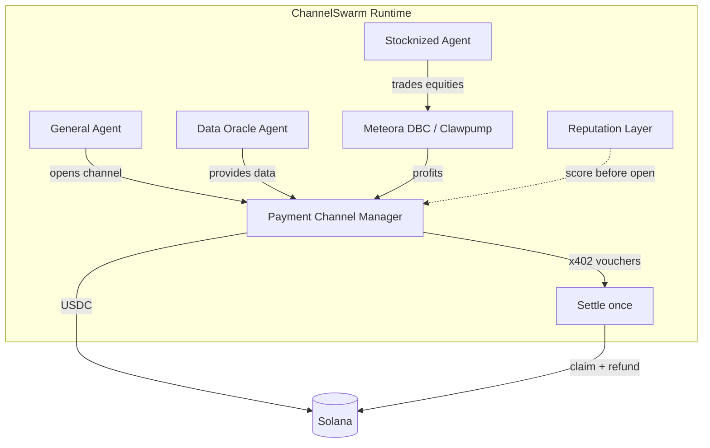

# ChannelSwarm

<div align="center">

**Autonomous Agent Economy on Solana**

[](https://hackathons.solana.com/)
[](LICENSE)
[](https://www.typescriptlang.org/)
[](https://github.com/solana-foundation/payment-channels)

**The only project that combines true Payment Channels + A2A micropayments + Stocknized Agents in one swarm.**

[Live Dashboard](#-live-dashboard) · [Quick Start](#-quick-start) · [Why This Wins](#-why-this-wins) · [Architecture](#-architecture)

</div>

---

## 🎯 Why This Wins

Judges look for **real differentiation**, not another trading bot.

| Feature | Typical Agent | **ChannelSwarm** |
|---------|---------------|------------------|
| Payments | 1 tx per payment | **Payment Channels** (1 open + 1 settle for thousands of payments) |
| Economy | Human-funded | **Agent-to-Agent** marketplace |
| Scale | Limited by gas | Designed for **1M+ payments/sec** primitive |
| RWA | None | **Stocknized Agent** trading tokenized equities |
| Safety | Soft limits | Hard spending ceilings + **reputation scores** |
| Self-funding | No | Stock profits → new channel capacity |

> **This exact combination does not exist in any other public Solana agent project.**

---

## 🏗 Architecture



### Core Flows

1. **Open Channel** — Agent deposits USDC ceiling → PDA created with counterparty
2. **High-frequency spend** — Off-chain signed vouchers (<10ms, $0 fee)
3. **Settle** — One on-chain tx claims actual usage and refunds the rest
4. **Stock loop** — Stocknized Agent trades tokenized stocks → profits fund new channels
5. **Reputation** — Successful settlements increase score; other agents check before opening channels

---

## 🚀 Quick Start

```bash
git clone https://github.com/wadezigh96/ChannelSwarm-Agent.git
cd ChannelSwarm-Agent
npm install
cp .env.example .env
# Add your SOLANA_PRIVATE_KEY (devnet is fine)

npm run demo
```

### Expected Demo Output

```
═══════════════════════════════════════════════════
  ChannelSwarm — Rarest Agentic Payments Agent
  Built for Solana Hackathons 2026
═══════════════════════════════════════════════════

[Swarm] Agent Alpha (general) online — 7xK9...a2f1
[Swarm] Agent DataOracle (data) online — 9mP2...b8c3
[Swarm] Agent StockHunter (stock) online — 4nR7...e1d9

--- Agents online ---
┌─────────┬─────────────┬──────────┬────────────┐
│ (index) │ name        │ role     │ reputation │
├─────────┼─────────────┼──────────┼────────────┤
│ 0       │ 'Alpha'     │ 'general'│ 1          │
│ 1       │ 'DataOracle'│ 'data'   │ 1          │
│ 2       │ 'StockHunter'│ 'stock' │ 1          │
└─────────┴─────────────┴──────────┴────────────┘

[Channel] Opened ch_7xK9a2f1_... with ceiling 5 USDC → 9mP2b8c3...
[x402/Channel] Voucher created for 0.002 USDC (cumulative 0.002)
... (20 micropayments)
[Stock] BUY 0.0109 AAPL @ $228.50 ($2.50)
[Stock] Strategy cycle PnL estimate: $-2.50
[Settle] Channel closed → claimed 0.0400 USDC, refunded 4.9600 USDC
[Reputation] DataOracle: 1.05 | Alpha: 1.02
[Swarm] Cycle complete — 0.0400 USDC flowed between agents
```

---

## 🖥 Live Dashboard

Open `dashboard/index.html` in any browser after running the demo, or serve it:

```bash
npx serve dashboard
```

The dashboard shows:
- Live agent status & reputation
- Open channels & cumulative spend
- Stock portfolio of the Stocknized Agent
- Settlement history

---

## 📦 Project Structure

```
ChannelSwarm-Agent/
├── src/
│   ├── payments/
│   │   └── channel-manager.ts    # Payment Channels + x402 voucher logic
│   ├── stock/
│   │   └── stocknized-agent.ts   # Tokenized equity trading agent
│   ├── reputation/
│   │   └── reputation.ts         # Score tracking & checks
│   ├── swarm/
│   │   └── orchestrator.ts       # Multi-agent coordination
│   └── index.ts
├── examples/
│   └── demo-swarm.ts             # Full end-to-end demo
├── dashboard/
│   └── index.html                # Visual dashboard for judges
├── SUBMISSION.md                 # Ready-to-copy hackathon submission text
├── package.json
└── README.md
```

---

## 🏆 Bounties Targeted

| Track | Fit |
|-------|-----|
| **Agentic Payments** | Native use of Payment Channels + x402 A2A economy |
| **Stocknized Agent on Clawpump** ($5k) | Dedicated agent that trades tokenized stocks |
| **Stocklana Main Track** | End-to-end stock agent that earns & reinvests into channels |

---

## 🛠 Tech Stack

- **Solana** — `@solana/web3.js` + `@solana/spl-token`
- **Payment Channels** — Designed for official `solana-foundation/payment-channels`
- **x402** — HTTP 402 micropayment pattern
- **Meteora DBC ready** — Stock-token launch path prepared
- **TypeScript** — Strict mode, fully typed

---

## 📈 Roadmap

- [x] Core Payment Channel state machine
- [x] Multi-agent swarm + reputation
- [x] Stocknized Agent strategy
- [x] Visual dashboard
- [ ] Wire real Payment Channels program (mainnet/devnet)
- [ ] Real Meteora DBC integration
- [ ] Public agent marketplace UI
- [ ] Seeker mobile monitoring app

---

## 📄 License

MIT

---

<div align="center">

**Built for Solana Hackathons 2026**  
*Agents that pay. Agents that earn. Agents that compound.*

</div>
