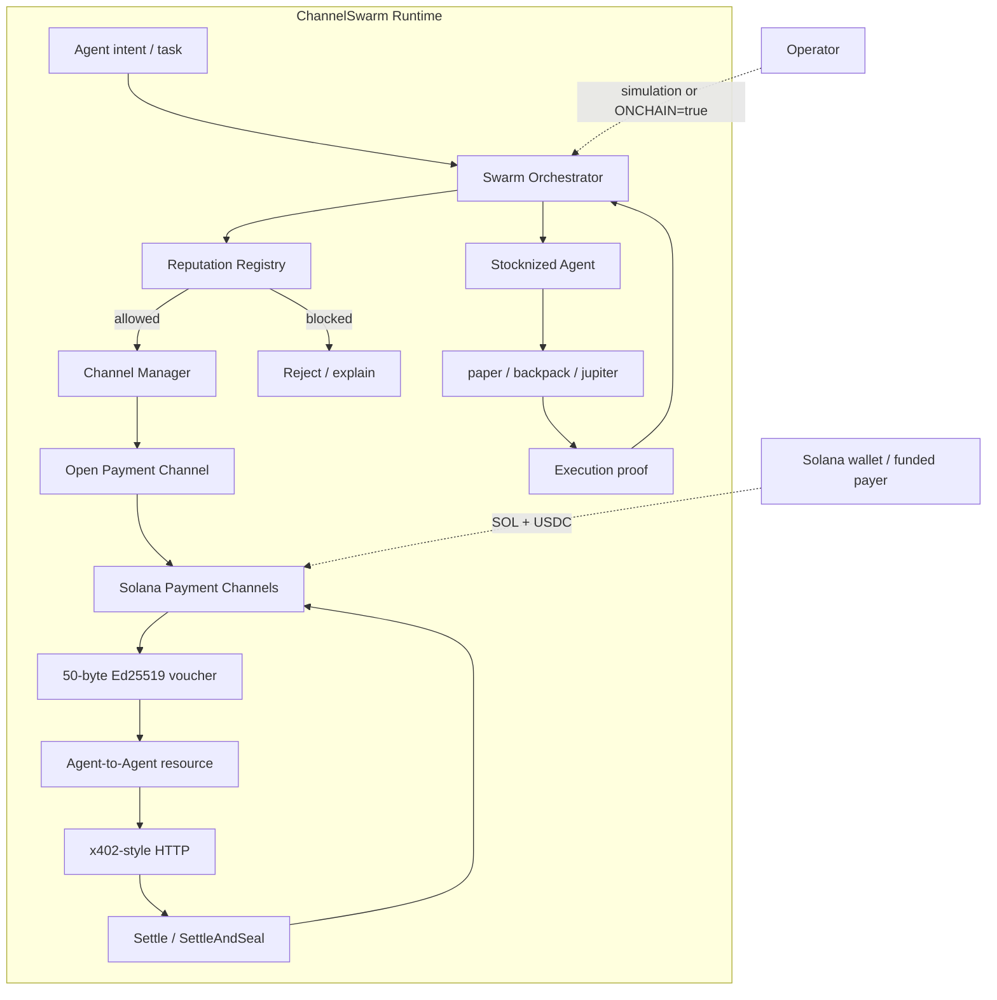

# ⚡ ChannelSwarm

> **Autonomous Agent Economy on Solana**

<div align="center">

**Agents that can earn · spend · coordinate · settle**

[](https://solana.com/)
[](https://www.typescriptlang.org/)
[](https://github.com/wadezigh96/Swarm_Agent/actions)
[](LICENSE)

[**Live Dashboard**](https://wadezigh96.github.io/Swarm_Agent/index.html) · [**Payment Channels Program**](https://explorer.solana.com/address/CHNLxYvVA28MJP9PrFuDXccuoGXAx7jBacfLEkahyGsX) · [**Submission**](SUBMISSION.md)

</div>

---

## 🧠 What is ChannelSwarm?

**ChannelSwarm** is a Solana-native prototype for agent-to-agent payments.

It combines:

- ⚡ **Payment Channels** — signed cumulative vouchers for micropayments
- 🤖 **Agent Swarm** — payer, oracle and trading agents coordinating together
- 🛡️ **Reputation** — score-gated agent participation
- 💳 **x402-style payments** — HTTP payment-required flow using signed vouchers
- 📈 **Stocknized Agent** — tokenized-equity strategy with **paper default** and **opt-in live execution** (Backpack RFQ or Jupiter xStock swaps)

> **Honest status:** payment-channel wire format and demo lifecycle are implemented. Tokenized-equity **execution path** is complete (paper / backpack / jupiter) with local execution proofs; live fills require credentials and funded accounts. Production persistence remains in-memory.

---

## ✨ Product Surface

| Module | What it does |
|---|---|
| **Agent Economy** | Coordinates Alpha, DataOracle and StockHunter |
| **Payment Channels** | Opens channels and creates signed cumulative vouchers |
| **Settlement** | Builds `settle`, `settleAndSeal` and close instructions |
| **x402-style HTTP** | Returns `402 Payment Required` and verifies signed payments |
| **Reputation** | Gates participation using agent reputation |
| **Stocknized** | Pyth (or paper) quotes + `EXECUTION_MODE=paper\|backpack\|jupiter` |
| **Dashboard** | Dark, agent-first GitHub Pages interface |

---

## 🔄 How it works

**Intent → Reputation → Payment Channel → Voucher → Agent Resource → Settlement**



### Runtime layers

| Layer | Responsibility |
|---|---|
| **Swarm Orchestrator** | Coordinates the agents and demo lifecycle |
| **Reputation** | Controls participation using agent scores |
| **Channel Manager** | Creates channels, vouchers and settlement paths |
| **Payment Channels** | Solana on-chain settlement primitive |
| **x402-style HTTP** | Payment-required resource flow using signed vouchers |
| **Stocknized Agent** | Strategy + unified execution path + proofs |

## 💸 Payment Channel

The implementation uses the live Solana Payment Channels program:

```
CHNLxYvVA28MJP9PrFuDXccuoGXAx7jBacfLEkahyGsX
```

Voucher wire format:

```
50 bytes
├── 2 bytes   magic/version
├── 32 bytes  channel PDA
├── 8 bytes   cumulative amount
└── 8 bytes   expiry
```

Each voucher is authenticated with **Ed25519**.

---

## 📈 Tokenized-equity execution

| Mode | Env | What happens |
|---|---|---|
| **paper** (default) | `EXECUTION_MODE=paper` | Simulated fills + local `ExecutionProof` |
| **backpack** | `EXECUTION_MODE=backpack` + API keys | STOCK RFQ submit → optional auto-accept → RFQ history proof |
| **jupiter** | `EXECUTION_MODE=jupiter` + mints + funded wallet | On-chain Jupiter swap of xStock mints → `txSignature` proof |

```bash
# Safe demo (always works without keys)
npm run demo:equity

# Backpack live (credentials + balance required)
EXECUTION_MODE=backpack BACKPACK_LIVE_TRADING=true BACKPACK_AUTO_ACCEPT_RFQ=true npm run demo:equity

# Jupiter live (mints + funded wallet required)
EXECUTION_MODE=jupiter USDC_MINT=... XSTOCK_AAPL_MINT=... npm run demo:equity
```

---

## 🤖 Agent Roster

| Agent | Role | Current mode |
|---|---|---|
| **Alpha** | Payment coordinator | Simulation / optional on-chain |
| **DataOracle** | Data signal provider | Demo |
| **StockHunter** | Strategy + stocknized layer | Paper default / opt-in live |

---

## 🧪 Current implementation status

| Capability | Status |
|---|:---:|
| 50-byte voucher + Ed25519 | ✅ |
| Deterministic channel PDA | ✅ |
| `open` instruction builder | ✅ |
| `settle` instruction builder | ✅ |
| `settleAndSeal` instruction builder | ✅ |
| `requestClose` path | ✅ |
| Agent swarm demo | ✅ |
| Reputation gating | ✅ |
| x402-style HTTP server | ✅ |
| Automated tests | ✅ |
| TypeScript build | ✅ |
| Tokenized-equity execution path (paper / backpack / jupiter + proofs) | ✅ |
| Production persistence | ⏳ |

---

## 🚀 Quick Start

```bash
git clone https://github.com/wadezigh96/Swarm_Agent.git
cd Swarm_Agent
npm install

npm test
npm run demo
npm run demo:equity
```

For an on-chain payment-channel attempt:

```bash
# Fund the payer with SOL + the required devnet USDC first.
ONCHAIN=true npm run demo
```

Without a funded wallet, the demo safely remains in simulation mode.

---

## 🖥️ Dashboard

The repository includes a dedicated GitHub Pages dashboard:

**https://wadezigh96.github.io/Swarm_Agent/index.html**

The dashboard is intentionally separate from the repository page: it is the interactive product surface, while this README is the project/hackathon presentation layer.

---

## 🏗️ Architecture

```
src/
├── payments/
│   ├── channel-manager.ts
│   ├── instructions.ts
│   ├── voucher.test.ts
│   ├── x402-server.ts
│   └── x402.test.ts
├── swarm/
│   └── orchestrator.ts
├── stock/
│   ├── stocknized-agent.ts
│   ├── jupiter-executor.ts
│   └── execution-mode.ts
├── execution/
│   ├── backpack-stock-client.ts
│   └── backpack-rfq-proof.ts
├── market/
│   └── pyth-client.ts
├── reputation/
│   └── reputation.ts
└── wallet.ts

examples/
├── demo-swarm.ts
├── equity-execution-demo.ts
├── stocklana-demo.ts
├── verify-backpack-stocks.ts
└── x402-demo.ts

docs/
└── index.html
```

---

## 🔐 Scope & limitations

- **Stocknized:** default is paper with local execution proofs. Live `backpack` / `jupiter` modes are opt-in and need credentials + funded accounts.
- **x402:** local x402-style transport, not a claim of full production x402 compatibility.
- **Persistence:** demo state is in memory.
- **On-chain payment channels:** opt-in and requires a funded payer.
- **Default demo:** simulation-first to avoid sending doomed transactions.

---

## 📚 Links

- [Repository](https://github.com/wadezigh96/Swarm_Agent)
- [Live Dashboard](https://wadezigh96.github.io/Swarm_Agent/index.html)
- [GitHub Actions](https://github.com/wadezigh96/Swarm_Agent/actions)
- [Submission](SUBMISSION.md)
- [Solana Payment Channels](https://github.com/solana-foundation/payment-channels)
- [Program Explorer](https://explorer.solana.com/address/CHNLxYvVA28MJP9PrFuDXccuoGXAx7jBacfLEkahyGsX)

---

## 📄 License

MIT · Built for Solana Hackathons 2026
