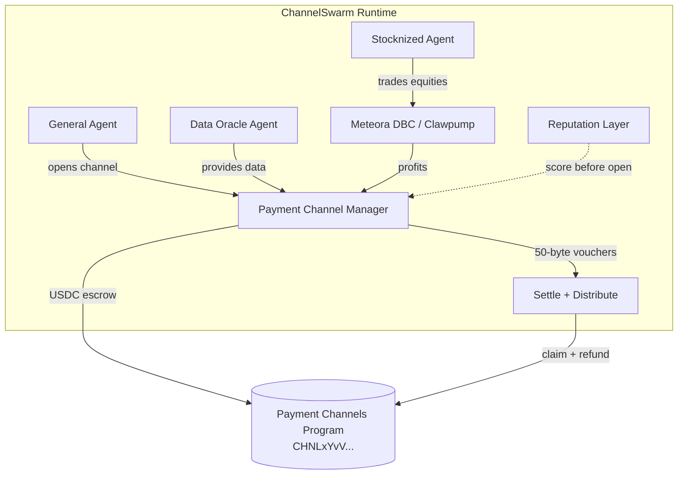

# ChannelSwarm

<div align="center">

**Autonomous Agent Economy on Solana**

[](https://hackathons.solana.com/)
[](https://explorer.solana.com/address/CHNLxYvVA28MJP9PrFuDXccuoGXAx7jBacfLEkahyGsX)
[](LICENSE)
[](https://www.typescriptlang.org/)

**Real Payment Channels program + A2A micropayments + Stocknized Agents**

[Live Dashboard](https://channel-swarm-dashboard.vercel.app) · [Quick Start](#-quick-start) · [Why This Wins](#-why-this-wins)

</div>

---

## 🎯 Why This Wins

Judges look for **real differentiation**, not another trading bot.

| Feature | Typical Agent | **ChannelSwarm** |
|---------|---------------|------------------|
| Payments | 1 tx per payment | **Official Payment Channels** (`CHNLxYvV...`) |
| Vouchers | Ad-hoc | **Canonical 50-byte Ed25519 wire format** |
| Economy | Human-funded | **Agent-to-Agent** marketplace |
| Scale | Limited by gas | Designed for **1M+ payments/sec** primitive |
| RWA | None | **Stocknized Agent** trading tokenized equities |
| Safety | Soft limits | Hard spending ceilings + **reputation scores** |

> Uses the **live mainnet program** from [solana-foundation/payment-channels](https://github.com/solana-foundation/payment-channels).

---

## 🔗 Real Payment Channels Integration

**Program ID (mainnet):** [`CHNLxYvVA28MJP9PrFuDXccuoGXAx7jBacfLEkahyGsX`](https://explorer.solana.com/address/CHNLxYvVA28MJP9PrFuDXccuoGXAx7jBacfLEkahyGsX)

### What we implement

- PDA derivation matching the official seeds: `channel`, payer, payee, mint, authorized_signer, salt, open_slot
- **Canonical 50-byte voucher message** + Ed25519 signing (exact format the program verifies)
- Full lifecycle documentation: `open` → vouchers → `settle` (with Ed25519 precompile) → `distribute` / refund
- Ready path to wire the generated TypeScript client from the official repo

### Voucher wire format (official)

```
Offset  Size  Field
0..2    2     magic [0x56, 0x01]
2..34   32    channel_id (PDA bytes)
34..42  8     cumulative_amount (u64 LE)
42..50  8     expires_at (i64 LE)
```

---

## 🏗 Architecture



---

## 🚀 Quick Start

```bash
git clone https://github.com/wadezigh96/ChannelSwarm-Agent.git
cd ChannelSwarm-Agent
npm install
cp .env.example .env
# Add SOLANA_PRIVATE_KEY (devnet is fine for demo)

npm run demo
```

Then open the **live dashboard**: https://channel-swarm-dashboard.vercel.app

---

## 📦 Project Structure

```
ChannelSwarm-Agent/
├── src/
│   ├── payments/
│   │   └── channel-manager.ts    # Real program ID + 50-byte vouchers + PDA
│   ├── stock/
│   │   └── stocknized-agent.ts
│   ├── reputation/
│   │   └── reputation.ts
│   ├── swarm/
│   │   └── orchestrator.ts
│   └── index.ts
├── examples/
│   └── demo-swarm.ts
├── dashboard/
│   └── index.html                # Live on Vercel
├── SUBMISSION.md
└── README.md
```

---

## 🏆 Bounties Targeted

| Track | Fit |
|-------|-----|
| **Agentic Payments** | Native Payment Channels program + x402 A2A |
| **Stocknized Agent on Clawpump** ($5k) | Dedicated tokenized equity agent |
| **Stocklana Main** | Earn → reinvest into channels |

---

## 📄 License

MIT

---

<div align="center">

**Built for Solana Hackathons 2026**  
*Agents that pay. Agents that earn. Agents that compound.*

Program: [CHNLxYvVA28MJP9PrFuDXccuoGXAx7jBacfLEkahyGsX](https://explorer.solana.com/address/CHNLxYvVA28MJP9PrFuDXccuoGXAx7jBacfLEkahyGsX)

</div>
