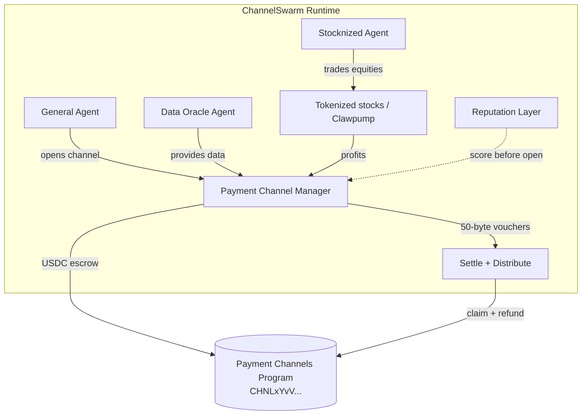

# ChannelSwarm

<div align="center">

**Autonomous Agent Economy on Solana**

[](https://hackathons.solana.com/hackathons/stocklana)
[](https://explorer.solana.com/address/CHNLxYvVA28MJP9PrFuDXccuoGXAx7jBacfLEkahyGsX)
[](LICENSE)
[](https://www.typescriptlang.org/)

**Real Payment Channels + A2A micropayments + Stocknized Agents**

[Live Dashboard](https://wadezigh96.github.io/Swarm_Agent/index.html) · [Explorer Program](https://explorer.solana.com/address/CHNLxYvVA28MJP9PrFuDXccuoGXAx7jBacfLEkahyGsX) · [Submission Text](SUBMISSION.md)

</div>

---

## Why This Wins

| Feature | Typical Agent | **ChannelSwarm** |
|---------|---------------|------------------|
| Payments | 1 tx per payment | **Official Payment Channels** (`CHNLxYvV...`) |
| Vouchers | Ad-hoc | **Canonical 50-byte Ed25519 wire format** |
| Economy | Human-funded | **Agent-to-Agent** marketplace |
| Scale | Limited by fees | Designed for **1M+ payments/sec** primitive |
| RWA | None | **Stocknized Agent** trading tokenized equities |
| Safety | Soft limits | Hard ceilings + **reputation scores** |

Uses the **live mainnet program** from [solana-foundation/payment-channels](https://github.com/solana-foundation/payment-channels).

---

## Real Payment Channels Integration

**Program ID (mainnet):** [`CHNLxYvVA28MJP9PrFuDXccuoGXAx7jBacfLEkahyGsX`](https://explorer.solana.com/address/CHNLxYvVA28MJP9PrFuDXccuoGXAx7jBacfLEkahyGsX)

- PDA seeds aligned with the official program
- Canonical **50-byte voucher** + Ed25519 signing
- Lifecycle: `open` → vouchers → `settle` → distribute / refund

### Voucher wire format

```
Offset  Size  Field
0..2    2     magic [0x56, 0x01]
2..34   32    channel_id (PDA bytes)
34..42  8     cumulative_amount (u64 LE)
42..50  8     expires_at (i64 LE)
```

---

## Architecture



---

## Quick Start

```bash
git clone https://github.com/wadezigh96/Swarm_Agent.git
cd Swarm_Agent
npm install
cp .env.example .env
# Add SOLANA_PRIVATE_KEY (devnet is fine for demo)

npm run demo
```

**Live dashboard:** https://wadezigh96.github.io/Swarm_Agent/index.html

---

## Project Structure

```
Swarm_Agent/
├── src/
│   ├── payments/channel-manager.ts   # Program ID + vouchers + PDA
│   ├── stock/stocknized-agent.ts
│   ├── reputation/reputation.ts
│   ├── swarm/orchestrator.ts
│   └── index.ts
├── examples/demo-swarm.ts
├── dashboard/index.html
├── docs/                             # GitHub Pages source
├── SUBMISSION.md
└── README.md
```

---

## Tracks

| Track | Fit |
|-------|-----|
| **Stocklana Main** | Earn → reinvest into channels |
| **Stocknized / Clawpump bounties** | Dedicated tokenized equity agent |
| **Agentic Payments** | Native Payment Channels + A2A |

---

## License

MIT

---

<div align="center">

**Built for Solana Hackathons 2026**  
*Agents that pay. Agents that earn. Agents that compound.*

[Live Demo](https://wadezigh96.github.io/Swarm_Agent/index.html) · [Program on Explorer](https://explorer.solana.com/address/CHNLxYvVA28MJP9PrFuDXccuoGXAx7jBacfLEkahyGsX)

</div>
